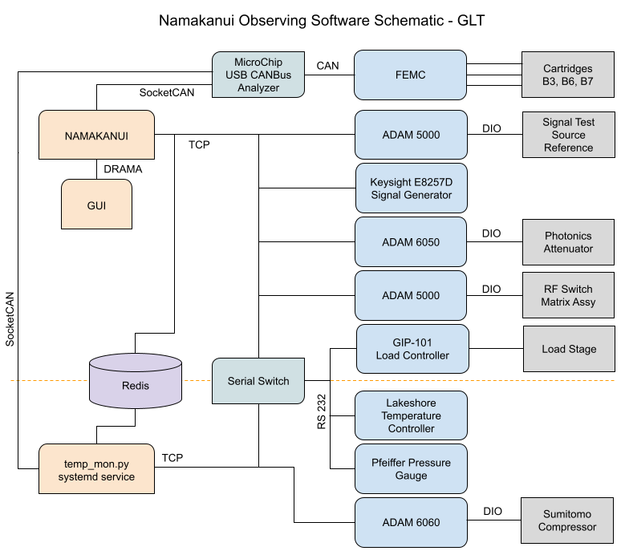
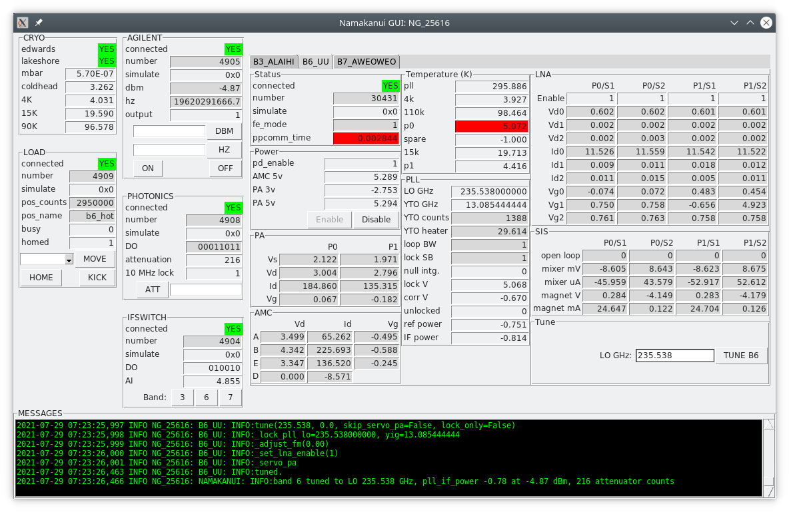

<!-- gfm -->

# Namakanui Software Overview - GLT

Ryan Berthold  
December 2021

## Introduction

The purpose of this document is to outline the operation of the Namakanui control and monitoring software, as currently installed at the GLT.  Namakanui is the JCMT ALMA-style heterodyne receiver, housing cartridge inserts for signal bands 3 (86 GHz), 6 (230 GHz), and 7 (345 GHz).

For the following discussion it may be helpful to refer to the code.  Our main Git repositories live on the internal JCMT filesystem, but a copy has been uploaded to Github and can be found here:

<https://github.com/eaobservatory/namakanui>

For the GLT installation, use the “glt” git branch.

## Programming Languages

The Namakanui software is mainly coded in Python 3.  The software package is composed of a library module holding class definitions to communicate with the system hardware, a set of scripts that make use of those classes to control and monitor the system, and configuration files.

The configuration files are a mix of `ini` and `ascii` (or `txt`) formats.  The `ascii` files hold space-separated table data that can be viewed in standard spreadsheets or other graphing software (we often use TOPCAT at the JCMT).

## Main DRAMA Tasks

Normal nighttime operations are handled by a set of DRAMA tasks running on a Linux computer (64-bit CentOS 7).  DRAMA is a message-passing interprocess communication framework developed at the AAO.  Though not natively supported, a Cython interface layer called pydrama has been developed at JCMT to allow the creation of DRAMA tasks in Python.

Note that these tasks only supply a minimal set of RPC interfaces needed to monitor and control the system while observing.  Other engineering functions are handled by individual command-line scripts, detailed in a separate section.

Currently the main observing tasks are as follows:

### `namakanui_task.py:  NAMAKANUI`
This script supervises the three cartridges and handles the rest of the shared hardware in the system.  It uses Redis to monitor the compressor, temperature, and vacuum states from namakanui_temp_mon.py, and publishes all hardware state to both DRAMA and Redis structures.

### `namakanui_gui.py:  NG_<PID>`
The GUI is a Tk window that communicates with the NAMAKANUI task.   It mainly serves to monitor and display the state of the system, and provides some limited control capabilities.

### `namakanui_temp_mon.py:`
This script runs as a system service.  It monitors the temperatures of the three cartridge inserts, and also monitors the Sumitomo coldhead compressor, Pfeiffer vacuum gauge, and Lakeshore temperature controller.  Data is published to the Redis database.

## GUI Description

The GUI can run on any 64-bit Linux computer on the JCMT network.  Multiple instances of the GUI can run simultaneously.  It does not monitor or control the system hardware directly; rather it uses DRAMA to communicate with the NAMAKANUI task running on the control computer.  The GUI script is written in Python, using the included Tk library to create the window and widgets.

Each frame on the GUI displays the status of a piece of system hardware, and has a few items in common:
- connected:  whether or not the GUI is receiving monitor updates for this system
- number: increments with each new status update
- simulate: nonzero if hardware communication is being simulated

Certain fields will be highlighted in red when outside their normal range.

For the frame descriptions below, please refer to the following screenshot:

### CRYO
Displays status from the Edwards pressure gauge and Lakeshore temperature controller.  Pressure is given in millibar, and the temperatures from the coldhead and separate thermal stages are given in kelvin.  Note that this frame lacks the “number” and “simulate” fields since the data is passed unmodified from the EPICS database.  Future versions of the software will also include a field for the ambient load temperature.

### LOAD
Displays status of the calibration load controller, and provides buttons to control the load position.  (This system consists of a rotary stage holding an ambient-temperature load, which can be moved in and out of the beam for each receiver insert.)

Fields:
- pos_counts:  position of the rotary stage, in steps
- pos_name:  named position for the current pos_counts, if any
- busy:  nonzero (red) while the stage is moving
- homed:  zero (red) if the stage has not been datumed

Actions:
- MOVE:  move the stage to the named position in the dropdown box
- HOME:  home the stage, only needed if the controller loses power
- KICK:  interrupt any MOVE or HOME action in progress and stop the stage

### AGILENT
Displays status of the Agilent N5173B or Keysight E8257D reference signal generator, and provides buttons to set signal frequency and output power.  Future versions of the software may give this frame a more generic name, such as “REFERENCE.”

Fields:
- dbm:  output power in dBm
- hz:  signal frequency in Hz
- output:  zero (red) if signal output disabled

Actions:
- DBM:  set output power to dBm value given in text box
- HZ:  set output frequency to Hz value given in text box
- ON/OFF:  enable or disable the signal output

### PHOTONICS
Displays status of the photonics receiver assembly, and provides a button to control the programmable attenuator.

Fields:
- DO:  bitfield showing the state of the ADAM module’s digital outputs
- attenuation:  attenuation in digital counts (1/8 dB per count)
- 10 MHz lock:  zero (red) if 10 MHz reference lost

Actions:
- ATT:  set attenuator to counts given in text box

### IFSWITCH
Displays status of the IF switch assembly, and provides buttons to control the selected band.  Future versions of the software will display the current band and 31.5 MHz signal status in a more user-friendly manner.

Fields:
- DO:  bitfield showing the state of the ADAM module’s digital outputs, normally 100100, 010010, or 001001 for selected band 3, 6, or 7.
- AI:  voltage of 31.5 MHz (FLOOG) signal lock status, red if less than 3.5

Actions:
- Band 3/6/7:  set IF switch to desired receiver band

## Receiver Tabs: B3 ALAIHI, B6_UU, B7_AWEOWEO
Each tab displays status for a single receiver insert, in the following frames:

### Status
- fe_mode:  FEMC control mode, 0=Operational, 1=Troubleshooting, 2=Maintenance.  We have found that even normal operations, like servoing the warm cartridge power amplifiers, require the FEMC to be in mode 1.
- ppcomm_time:  FEMC CANBus “ping” time, red if >2ms

### Power
- pd_enable:  zero (red) if no power to the receiver insert
- AMC 5v:  voltage to the active multiplier chain, normally +5V
- PA 3v: warm cartridge power amplifier 3V supply, normally -3V
- PA 5v: warm cartridge power amplifier 5V supply, normally +5V
- Enable/Disable:  these buttons will turn cartridge power on and off

### PA
Displays parameters for the warm cartridge LO power amplifiers for the P0/P1 polarization mixer blocks.
- Vs:  drain voltage “scale” setting (unitless value between 0 and 2.5)
- Vd:  drain voltage
- Id:  drain current, mA
- Vg:  gate voltage

### AMC
Displays parameters for the active multiplier chain stages, A, B, E, and D (multiplier, Vd and Id are voltage and current).  We have no tuning tables for these parameters and they are always left at the default settings.

Per stage (except D):
- Vd:  drain voltage
- Id:  drain current
- Vg:  gate voltage

### Temperature (K)
Shows current values of cartridge temperature sensors, in kelvin.  Highlighted red if outside nominal range (but these thresholds may need some adjustment).  Available sensors for band 3 are slightly different; the following apply to bands 6 and 7:
- pll:  phase locked loop assembly
- 4k, 15k, 110k:  thermal stages
- p0, p1:  mixer blocks

### PLL
Displays status of the local oscillator phase locked loop.
- LO GHz:  local oscillator frequency in GHz; may be zero when the software is first started up until the first tuning command is given, even if the hardware is still locked.
- YTO GHz: YIG tunable oscillator frequency in GHz, derived from LO GHz
- YTO counts:  YTO coarse setting, 0 to 4095
- YTO heater:  YTO heating current in mA
- loop BW:  control loop bandwidth, 0=7.5 MHz/V, 1=15 MHz/V
- lock SB:  determines if LO locks below (0) or above (1) the reference signal
- null intg.:  1 if the control loop integrator is ignored/reset (for coarse adjustment)
- lock V:  loop lock indicator voltage, locked if >3V
- corr V:  correction voltage applied to YTO, -10V to +10V, ~2.5 MHz/V
- unlocked:  latched to 1 if lock is lost; remains 1 (even if lock is automatically reestablished) until the next tune command
- ref power:  31.5 MHz (FLOOG) signal power, arbitrary units; want -.7 to -2.5
- IF power:  signal generator input power, arbitrary units; want -.7 to -2.5

### LNA
Low-noise amplifier readings for each polarization/mixer.  Three stages are displayed though they may not be present for all bands (e.g. band 6 has only one stage and only the 0 values are valid).
- Enable:  zero (red) if LNA disabled for this mixer
- Vd*:  drain voltage
- Id:  drain current, mA
- Vg: gait voltage

### SIS
Parameters for each polarization/mixer.  Magnet parameters for e.g. band 6 are per-polarization (only two magnets, not four), but all four readouts are given.
open loop:  zero if closed loop (?) (default state)
- mixer mV:  mixer bias voltage
- mixer uA:  mixer current
- magnet V:  magnet voltage
- magnet mA:  magnet current

### Tune
The TUNE button will tune this band’s LO to the given GHz value and automatically adjust the receiver parameters for nominal performance.  Tuning details are given in later sections.

### Messages
Informational messages, warnings, and errors from the connected DRAMA tasks will appear in this area.

## Cryogenic Monitoring Service

The main DRAMA tasks may not run all the time; they may only be started for nightly observations and then terminated afterward.  However, we wish to monitor and log the state of the cryogenic system continuously.  For this purpose we have a special script called namakanui_temp_mon.py that runs as a systemd service.

The namakanui_temp_mon.py script reads the cartridge temperatures once per minute using direct commands to the FEMC, rather than the higher-level cartridge control class, in order to minimize interaction with the rest of the system.  The temperatures are appended to a log file on the JCMT network using a simple space-separated ASCII format.  Additionally, the script sends the cartridge temperatures to the Redis database.

The script also monitors the state of the Sumitomo coldhead compressor, Lakeshore temperature controller, and Pfeiffer vacuum gauge, and sends these values to the Redis database as well.

## Namakanui Python Module

The software defines a “namakanui” Python package which can be imported into other scripts.  Each module in this package defines a class which is used to interface with a particular hardware system.

Generally, each class instance is constructed using a configuration file, “sleep” and “publish” functions, and simulation settings.  The “sleep” and “publish” functions are used to make the class instance compatible with the DRAMA framework when used within a task script.  For non-DRAMA scripts, these are usually just time.sleep and nop (or print) functions.

The classes commonly provide an “initialise” function to (re)connect to the hardware, as well as an “update” function (meant to be called in a loop) which queries the hardware and publishes the current state.

### cart.py
The Cart class controls a single cartridge band using a shared instance of the FEMC class.  Its main function is to tune the receiver and set the proper mixer parameters.

### compressor.py
The Compressor class uses an ADAM-6060 to monitor the status of the Sumitomo CNA-61D coldhead compressor.

### femc.py
The FEMC class uses SocketCAN to access a MicroChip USB CANBus device, and thereby communicate with the FEMC hardware.  Provides low-level cartridge monitoring and control functions.

### ifswitch.py 
TODO REMOVE

### ini.py
This file provides a class for parsing .ini configuration files, as well as functions to read and interpolate table data.

### instrument.py
The Instrument class acts as a supervisor, and holds instances of the other hardware classes in the system.  

### lakeshore.py
The Lakeshore class monitors a model 218 or 336 temperature controller, which has probes for each of the cryogenic stages in the dewar.

### load.py
The Load class connects to the GIP-101 rotary stage controller via a serial switch on the local network.  It provides functions to home the stage and move it to specified positions, in order to insert or remove the ambient calibration load from a receiver’s beam.

### pfeiffer.py
The Pfeiffer class monitors a 252A vacuum gauge.

### photonics.py 
The Photonics class connects to an ADAM 6050 in the reference signal optical receiver.  Digital outputs from the ADAM control a programmable attenuator, which is used to adjust the power of the reference signal.  The digital input is used to monitor the state of the 10 MHz lock.

### pmeter.py
The PMeter class connects to an N1913A or N1914A power meter.

### reference.py
The Reference class connects to the reference signal generator, either an Agilent N5173B or Keysight E8257D.  It provides functions to set the frequency and output power, and stores the output power tables from the configuration file.

### sim.py 
This file defines the “simulate” bitmask values used by the other classes, and provides functions to convert them to and from strings.

### util.py 
This file provides miscellaneous functions used by other scripts, including a high-level “tune” function which locks the receiver and automatically adjusts reference signal power.  It also provides a few functions for interacting with the ACSIS IFTASK via DRAMA, which are used by engineering scripts to get the IF power levels.

### version.py 
This file is created by the build system with info from Git.

## Engineering Scripts

The DRAMA tasks used during observing provide only basic monitoring and control; a separate set of command-line scripts provides more advanced functionality.  These scripts are generally not DRAMA tasks themselves, except where required to query IF power levels from ACSIS.  Normally these scripts should not be run at the same time as the observing tasks, to avoid confusing the system (run a “drama_nuke” first).

There are quite a number of these scripts, and only a few are covered below.  For other scripts in the src/ directory, please consult the docstring (header comment) and the “--help” output.

### att_table.py
Tune across a range of frequencies to build an attenuation table for the photonics system.

### dbm_photo.py
Create an output power table for the signal generator to achieve constant input power to the photonics transmitter.  Requires an N1913A power meter.

### dbm_table.py
Tune across a range of frequencies to build an output power table for the reference signal generator.  Only used if the signal generator is connected directly to the receiver, with no photonics attenuator.

### deflux.py
Demagnetize and deflux the mixers using the internal heaters.  Testing has shown that the internal heaters are ineffective, so if defluxing is necessary it must be accomplished via a mini-warmup (by temporarily shutting off the coldhead compressor).

### mixer_iv.py
Sweeps the mixer bias voltages to generate IV curves, then disables the PA and sweeps again for the unpumped LO curves.  Plots with matplotlib.  This script uses only low-level FEMC commands and does not tune first, so use it after calling tune.py.

### pa_table.py
Create a PA drain/gate voltage table to speed up mixer current optimization during future tune calls.

### power_down.py
Prepares receivers for shutdown so that turning off the FEMC will not cause trapped flux.  Sets reference signal to minimum levels and ramps bias voltages and magnet currents to zero.

### set_load.py
Control the ambient load rotational stage from the command line.

### trx_sweep.py
Calculate noise temperature across a range of frequencies, using IF power levels measured by ACSIS.  Requires a cold load (liquid nitrogen bucket) to be placed in the beam.

### tune.py
Tune a receiver band.  Sets the IF switch, adjusts reference signal power, locks the LO PLL, and optimizes mixer parameters.

### yfactor_same.py
Calculates Y-factor (either on-sky or with a cold load in the beam) while varying receiver parameters.  These scripts can be used to adjust target mixer currents and bias voltages for optimum gain.

